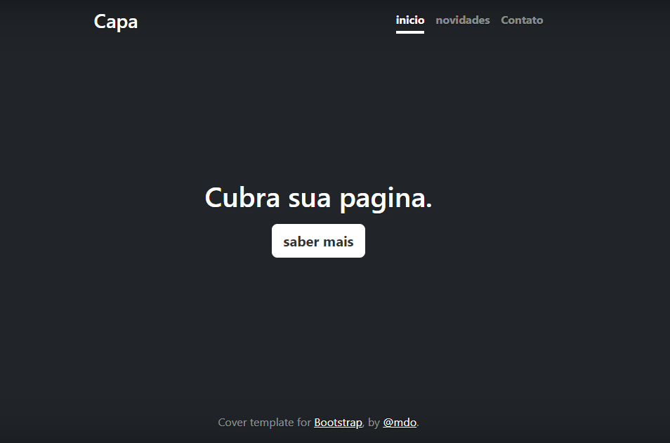

# índice 

* [projeto - aprendendo a escrever um README](#projeto---aprendendo-a-escrever-um-readme)
* [descrição](#descrição)
* [introdução](#introdução)
* [funcionalidades](#funcionalidades)
* [tecnologias utilizadas](#tecnologias-utilizadas)
* [fontes consultadas](#fontes-consultadas)
* [autores](#autores)

# projeto - aprendendo a escrever um README

## descrição

## introdução

## funcionalidades

### tecnologias utilizadas

## fontes consultadas

## autores